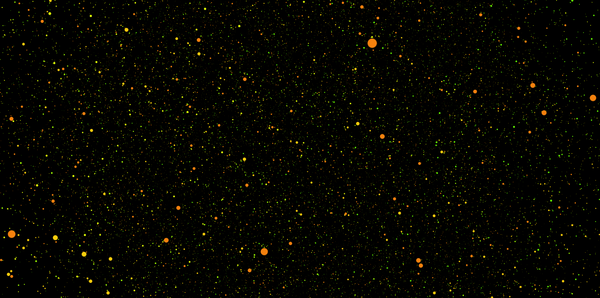

# WebGl with Three.js Experimental

Just Simple Followed Tutorial [Three.js Example](https://threejs.org/examples/) and Experimental with [Google Mediapipe](https://google.github.io/mediapipe/)

## Point-Cloud

<strong>First Step</strong>

- Inspiration from https://noni.cmiscm.com/
- example from https://codepen.io/seanseansean/pen/EaBZEY
- DEMO : https://kocopalm.net/cdn/point-cloud/index.html

